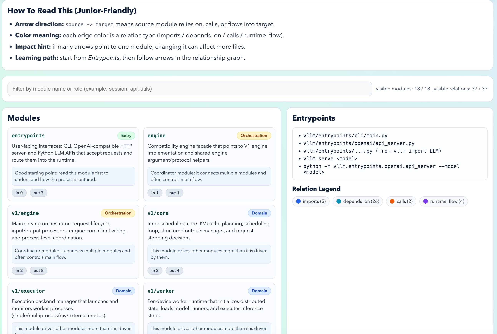
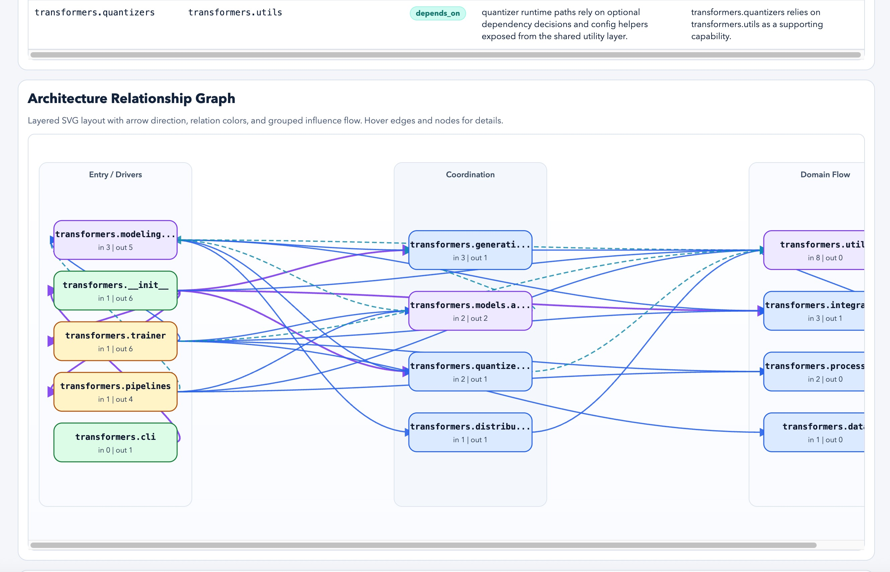
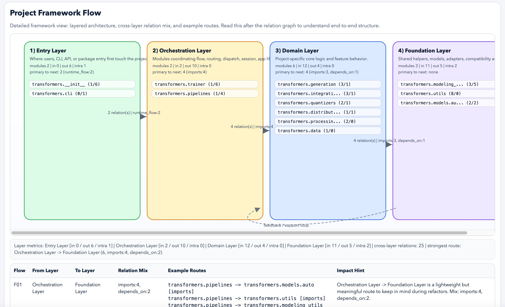

<div align="center">
  <h1>CodeAtlas</h1>
  <p><strong>一个轻量化仓库架构图谱 Skill：输入仓库，直接产出单文件 HTML 关系图</strong></p>
  <p>
    <a href="./README.md"></a>
    <a href="./README_ZH.md"></a>
    <a href="https://docs.anthropic.com/en/docs/claude-code/skills"></a>
    <a href="./LICENSE"></a>
  </p>
</div>

CodeAtlas 是一个实用型 Skill：把 GitHub 仓库 URL 或本地代码目录，转成“架构级模块关系图”，并在一次调用中输出 `codeatlas.html + module-map.json + summary.md`。

## 项目定位

| 这个项目是 | 这个项目不是 |
| --- | --- |
| 面向模块关系的轻量化 Skill | 全量静态分析平台 |
| 一次调用即出结果的输出契约 | 复杂重型分析流水线 |
| 本地可直接打开的 HTML 图谱（`file://`） | 依赖后端服务的可视化系统 |
| 适合 Codex / Claude 工作流的技能组件 | v1 私有仓库认证方案 |

## Feature 介绍

| Feature | 价值 |
| --- | --- |
| 支持 GitHub URL / 本地路径输入 | 直接接入真实仓库分析 |
| 架构级关系抽取 | 关注模块间逻辑，不陷入函数细节噪声 |
| 单文件 HTML 产物 | 结果可分享、可归档、可离线打开 |
| 双 SVG 图视图 | 一次输出同时包含分层关系图和详细流程框架图 |
| Framework Flow 细节表 | 展示跨层关系类型占比、示例路径和影响提示，便于架构讨论 |
| 初学者友好解释层 | 模块卡片和关系表附带易懂说明，降低阅读门槛 |
| 内嵌 JSON 数据契约 | 方便后续二次处理、评测和可视化迭代 |
| 多平台迭代测试 | 可在 `opencode` 和 `codex` 间反复验证 |
| bad case 反哺能力 | 通过日志沉淀失败模式，持续优化 Skill |

## 案例展示

| vLLM 案例 | Transformers 案例 A | Transformers 案例 B |
| --- | --- | --- |
|  |  |  |

## 输入输出契约

### 输入

- 公开 GitHub URL：`https://github.com/<owner>/<repo>`
- 本地仓库路径

如果输入 GitHub URL，不需要你手动下载代码。  
CodeAtlas 会自动拉取到临时目录后直接分析。

### 输出目录

`outputs/skill-runs/<run-id>/`

### 必需文件

- `codeatlas.html`
- `module-map.json`
- `summary.md`

`codeatlas.html` 必须满足：
- 单文件
- 包含 `<script id="codeatlas-data" type="application/json">`
- 不使用 `fetch()` 读取本地数据
- 不引用外部 `<script src="http(s)://...">` 或 `<link href="http(s)://...">`
- 包含分层关系 SVG 图（带图例）
- 在关系图下方包含流程框架 SVG 图
- 包含 Framework Flow 细节表（关系 mix + 路径示例 + 影响提示）
- 关系区包含面向初级工程师的解释列

### `module-map.json` 基础结构

```json
{
  "project": "string",
  "source": "string or object",
  "modules": [{ "name": "string", "role": "string" }],
  "relations": [
    {
      "source": "string",
      "target": "string",
      "type": "imports|depends_on|calls|runtime_flow",
      "reason": "string"
    }
  ],
  "entrypoints": ["string"]
}
```

## 工作流

1. 识别输入源（GitHub 或本地目录）。
2. 基于目录结构和 import 信息构建模块图。
3. 生成 `module-map.json`。
4. 生成单文件 `codeatlas.html`（内嵌 JSON + 分层关系图 + 流程框架图）。
5. 输出 `summary.md`（结论、关键关系、盲区风险）。
6. 结束前执行约束校验。

## 安装方式

### Codex 个人安装

```bash
mkdir -p ~/.codex/skills/codeatlas
cp -R . ~/.codex/skills/codeatlas
```

### Claude Code 个人安装

```bash
mkdir -p ~/.claude/skills/codeatlas
cp -R . ~/.claude/skills/codeatlas
```

### 项目级安装

```bash
mkdir -p .codex/skills/codeatlas
cp -R . .codex/skills/codeatlas
```

## 启动提示词示例

```markdown
Use $codeatlas to analyze this repository and output files under outputs/skill-runs/<run-id>/:
- codeatlas.html
- module-map.json
- summary.md

Source: <GitHub URL or local path>
Constraints:
- architecture-level module relations
- codeatlas.html must be single-file with embedded codeatlas-data
- include layered relation graph + framework flow graph
- include beginner-friendly explanations
- no fetch, no external script/link URLs
```

## 已验证测试结果（2026-03-11）

推荐展示用产物：
- `outputs/skill-runs/vllm-codex-fast-medium-attempt-13/`
- `outputs/skill-runs/sglang-codex-fast-medium-attempt-14/`
- `outputs/skill-runs/transformers-codex-fast-medium-attempt-15/`

迭代日志：
- 本地记录（已忽略，不进入仓库）：`logs/attempts.md`

## 仓库结构

```text
code_atlas/
|-- SKILL.md
|-- README.md
|-- README_ZH.md
|-- agents/openai.yaml
|-- assets/
|   `-- codeatlas-single-file-template.html
|-- references/
|   |-- input-output.md
|   |-- html-requirements.md
|   `-- attempt-checklist.md
|-- scripts/
|   `-- new-run-id.sh
|-- outputs/
|   `-- skill-runs/
`-- LICENSE
```

## About 描述建议（GitHub）

建议短描述（About）：

`Lightweight skill that turns a GitHub repo or local codebase into a single-file HTML architecture graph (plus JSON + summary).`

建议 Topics：

`skills`, `codex`, `claude-code`, `code-analysis`, `architecture`, `knowledge-graph`, `html-visualization`, `repository-mapping`

## License

MIT，见 [`LICENSE`](./LICENSE)。
